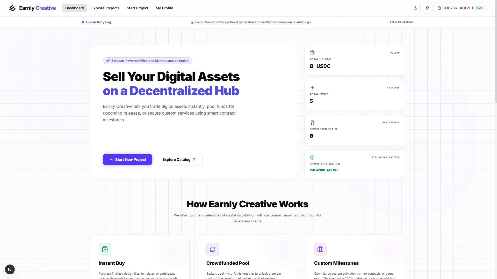

# 🎨 Earnly Creative

**A Soroban-gated digital marketplace with crowdfund pool and milestone escrow, powered by Stellar.**  
**Developed by Team Orbitera**

https://earnly-creative.vercel.app/
---

## 📌 Project Description

Earnly Creative is a hybrid Web3 marketplace built on the **Stellar Network** using **Soroban smart contracts** for buying and selling digital assets, crowdsourced fundraising, and milestone-based custom services. The platform uses on-chain transaction verification to gate access to encrypted deliverables.

The platform supports three project types: **Instant Buy** (direct purchase with immediate delivery), **Crowdfund Pool** (multi-backer funding with auto-complete), and **Custom Milestone Escrow** (client-locked budget with milestone-based voting and weighted payouts). A mock blockchain engine allows full development and demo without a Stellar network connection.

---

## 🖼️ Screenshot



---

## 🔗 Contract

```
Network     : Stellar Testnet
Contract    : CDAXXGA55Q6AXCAI6YHK575EFTQZW5C22R2OAJQI6C2OGHSA6LEN63VA

Netwiork    : Main Net
Contract    : CC7B2NCHNK5VWLEK6HF2WPQAZWDBPVBWZ7JZRV4OJQN4FJZNIUGLIEOQ

```

---

## ✨ Key Features

- **Connect Stellar Wallet**: Easy integration using Freighter.
- **Flexible Project Models**: Create projects as Instant Buy, Crowdfund Pool, or Custom Milestone Escrow.
- **Milestone Escrow Protection**: Pledge, purchase, or lock budget in smart contract escrow with stage-by-stage voting and weighted payouts.
- **ZK Identity Verification**: Register as a verified creator with Zero-Knowledge identity proof (anti-Sybil via nullifier hash) for 100% privacy-preserving trust.
- **Access-Gated Decryption**: Download encrypted deliverables with on-chain access gating.
- **Cross-Environment Support**: Seamlessly switch between local simulation sandbox, testnet, and mainnet modes.

---

## ⚙️ How It Works

1. Creator connects a Stellar wallet and submits a creator application with ZK proof.
2. Admin approves the creator on-chain and off-chain.
3. Creator fills in project details: title, description, category, price, files, milestones.
4. File deliverables are encrypted with AES-256-CBC before upload.
5. Contributors browse the marketplace and pledge/purchase/lock budget.
6. For escrow projects, contributors vote to approve each milestone.
7. Upon milestone approval, creator claims weighted funds from the contract.
8. Contributors download files via an access-gated endpoint that verifies on-chain status.
9. On-chain state is mirrored in Supabase for fast off-chain queries.

---

## 🔐 Privacy & Security Model

Earnly Creative does not store file contents or user identities directly on-chain.

Only the following data is stored on-chain:
- Campaign ID and metadata
- Creator and client wallet addresses
- Pledged and withdrawn amounts
- Milestone vote tallies
- ZK nullifier hash (anti-Sybil, no personal data)

File deliverables are encrypted with **AES-256-CBC** before storage. Decryption keys are stored in Supabase with Row-Level Security. The on-chain contract only verifies contributor access status — the actual file stream is decrypted server-side.

ZK identity verification is performed locally in the browser. Only a mathematical hash (nullifier) is recorded on-chain, preventing duplicate registration without exposing identity.

---

## 🧩 Smart Contract Methods

The contract interface is defined in `contracts/earnly-co-fund/src/lib.rs`.

| Function | Auth | Description |
|---|---|---|
| `initialize(admin, token)` | - | Init contract with compliance admin and USDC token |
| `set_creator_status(admin, creator, approved)` | Admin | Creator gating |
| `set_verifier_key(admin, key)` | Admin | Set ZK public key |
| `verify_creator_zk(creator, nullifier, proof)` | Creator | Self-sovereign ZK identity verification |
| `is_creator_approved(creator)` | View | Check creator approval status |
| `create_campaign(...)` | Creator | Create campaign with milestones |
| `set_milestone_percentages(creator, id, pcts)` | Creator | Adjust milestone weights (must total 100%) |
| `pledge_funds(contributor, id, amount)` | Contributor | Buy / pledge / lock budget |
| `vote_milestone(contributor, id, approve)` | Contributor | Vote on milestone completion |
| `claim_milestone_funds(creator, id)` | Creator | Withdraw milestone-weighted funds |
| `claim_refund(contributor, id)` | Contributor | Refund if aborted or failed |
| `abort_campaign(creator, id)` | Creator | Cancel campaign |
| `complete_campaign(creator, id)` | Creator | Finalize campaign |
| `get_campaign(id)` | View | Read campaign state |
| `get_pledge(id, contributor)` | View | Read contributor pledge |
| `get_vote(id, milestone, contributor)` | View | Read contributor vote |
| `get_vote_tally(id, milestone)` | View | Read milestone voting result |
| `is_contributor(id, addr)` | View | Check contributor status |

---

## 🛠️ Tech Stack

| Layer | Technology |
|---|---|
| **Frontend** | Next.js 16.2, React 19.2, Tailwind CSS v4, Framer Motion 12 |
| **Smart Contract** | Stellar Soroban (Rust, SDK 26) |
| **Database** | Supabase (PostgreSQL + Row-Level Security) |
| **File Storage** | Cloudinary (images), Cloudflare R2 / Local (encrypted deliverables) |
| **Encryption** | AES-256-CBC (browser-side encrypt, server-side decrypt) |
| **Web3 Wallet** | Freighter (`@stellar/freighter-api`) |
| **Blockchain SDK** | `@stellar/stellar-sdk` |

---

## 🚀 Installation and Running the Project

Install dependencies:

```bash
npm install
```

Run the development server (mock mode — no wallet required):

```bash
npm run dev
```

Build for production:

```bash
npm run build
```

Run lint:

```bash
npm run lint
```

---

## 👛 Wallet

Use a Stellar wallet compatible with `@stellar/freighter-api`:

- **Freighter**: [https://freighter.app](https://freighter.app)

---

## 📁 Project Structure

```
earnly-cofund/
├── contracts/earnly-co-fund/src/   # Soroban Smart Contract (Rust)
│   ├── lib.rs                      # Contract logic
│   └── test.rs                     # Unit tests
├── src/
│   ├── app/                        # Next.js App Router
│   │   ├── page.tsx                # Dashboard with hero, stats, featured projects
│   │   ├── layout.tsx              # Root layout + AlertSystem
│   │   ├── globals.css             # Tailwind v4 + custom theme
│   │   ├── create/page.tsx         # Multi-step project creation form
│   │   ├── projects/page.tsx       # Marketplace catalog + filters
│   │   ├── project/[id]/page.tsx   # Project detail + on-chain actions
│   │   ├── profile/page.tsx        # User profile + ZK verification + admin
│   │   ├── profile/[address]/page.tsx  # Public creator profile
│   │   └── api/                    # 7 REST endpoints
│   │       ├── projects/route.ts
│   │       ├── projects/[id]/route.ts
│   │       ├── creators/route.ts
│   │       ├── transactions/route.ts
│   │       ├── upload/route.ts
│   │       ├── download/[id]/route.ts
│   │       └── images/[filename]/route.ts
│   └── lib/
│       ├── stellar.ts              # Blockchain abstraction (mock + real)
│       ├── db.ts                   # Supabase layer
│       └── notifications.ts        # Local notification system
├── supabase/                       # SQL schema
└── public/                         # Static assets
```

## 🔮 Future Roadmap

To enhance user onboarding and platform capabilities, the following features are planned for future releases (interactive mockups and simulators are available in the pitch deck):

1. **Gasless Protocol (Sponsored Transactions)**:
   - Integrate Stellar's native **Fee-Bump Transactions** (CAP-0015).
   - Allows users to interact with Earnly Creative contracts and purchase assets using only their USDC balance with **0 XLM fees**. The platform relayer pays the XLM gas fees and recovers them directly in micro-amounts of USDC.
2. **Decentralized Arbitration Courts**:
   - Establish decentralized juror pools where selected community members can vote on project disputes and earn token rewards for maintaining high-quality arbitration.
3. **Embeddable Checkout SDK**:
   - Create a lightweight JavaScript SDK enabling external Web2 websites or blogs to easily embed token-gated digital file checkout buttons with under 5 lines of code.

---

## 🔄 Regenerate Contract Interface

If the smart contract is upgraded, rebuild and deploy:

```bash
cd contracts/earnly-co-fund
stellar contract build
stellar contract deploy \
  --wasm ../../target/wasm32v1-none/release/earnly_co_fund.wasm \
  --source <secret-key> \
  --network testnet
```

Run Rust unit tests:

```bash
cd contracts/earnly-co-fund && cargo test
```
